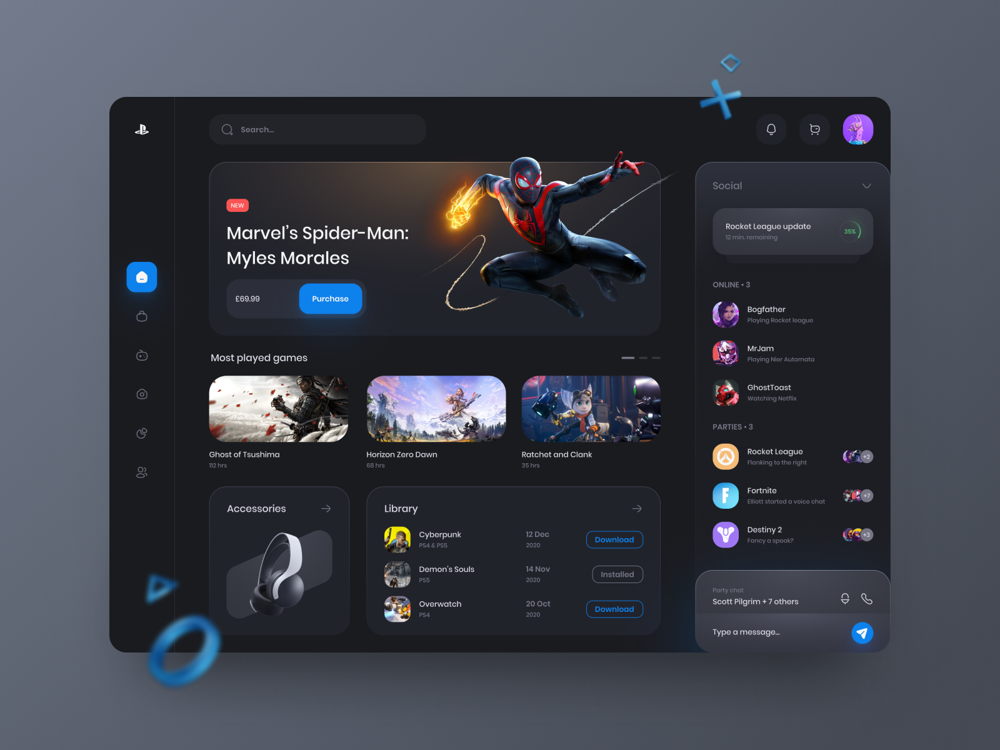
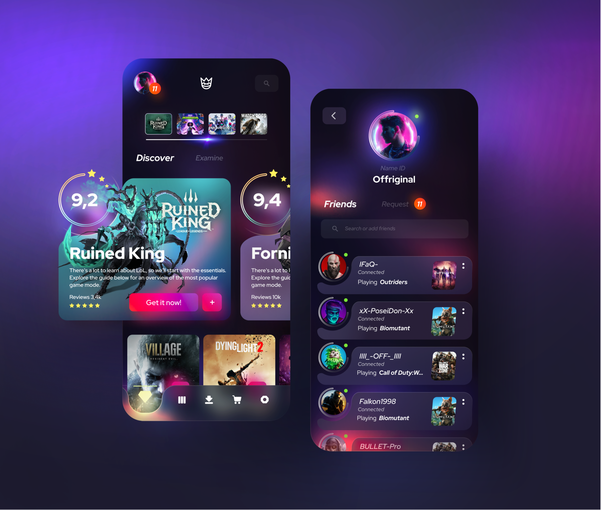

# EveryoneGames

| Challenge Parameters | Challenge Details   |
| :------------------- |:--------------------|
| Repository           | `EveryoneGames`     |
| Challenge type       | `Consolidation`             |
| Duration             | `5 days`            |
| Deadline             | `08/05/2023`        |
| Deployment method    | `Netlify or Vercel` |
| Group composition    | `Duo`              |

## Mission objectives

- [ ] Consolidate your knowledges in React.
- [ ] Respect the clients needs.
- [ ] Be creative when the clients are vague.
- [ ] Create a projects from scratch that is scale-able in the future.

## Mission

You're client would like to have their own **_video game_** website. A website that they could use to see all up-coming video games, and all existing video games on diverse platforms. **They don't have the budget for a designer**, and hand you some **_images they found on the Internet_** to give you and idea of look and feel of the site.
They completely trust you and think you are capable enough as a front-end developer to come up with your own touch while following the feel of the pictures.

API: https://rawg.io/apidocs

#### Code Quality

We need you to enforce your _code quality_.

That's why you will use [Prettier](https://prettier.io) to format your code, and [ESLint](https://eslint.org) to ensure your code following _good practices_.

> 🧨 **WARNING:** disable ESLint **is not** an option!

## The images

## Must have

> This about the must haves in the React tool-belt.

- Framer-motion
- React Routing system
- Styled components
- Uuid

## Optional

> But still highly recommended to investigate and use in your future if you want to become a React developer.

- Next.js

## Client needs

### Home page

The homepage will show all **new and trending** video games.
You either add a **pagination** that shows a maximum amount of games, or create and **infinite** load.

You can select other categories that will display different games.

#### Must have categories:

- New releases
- Next week releases
- Best of the year (popular games)

The user can search for games by name and use filters.

**Filter one :**

- Date added
- Name
- Release date

**Filter two:**

- All platforms in the database.

Every game will be displayed inside a card, this card contains tiny details such as:

- Average score
- platforms
- title
- release date
- genres
- ...

Don't display all details just like that, make certain details appear when the user hovers over a card.
When the user selects a card, they get redirected to the game page.

## Game page

On this page the user will find all the details about the game, including trailers, screen-shots, ...  
Add to the page that what you think is important for the user to see.

The user still has access to the search-bar on this page to return to the homepage.

## Done?

Applications are never really finished. Try to come up with some extra features.
What about comparing games?
More categories?
Maybe your favorite games that get saved to the local storage and if it exists, shown on a favorite page?

All of these sound maybe complicated, but if you build your application correctly it should be easy to add new features.

## Now Mr(s). Developer, it's up to you.

